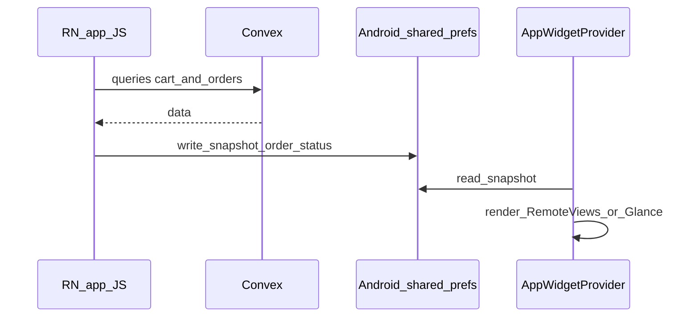

# Android dynamic home screen widgets

## Product goal (order status)

The widget should communicate **where the customer’s order is in the pipeline**, using the same statuses as the backend and mobile app:

| Convex `status` | User-facing copy (match app) |
| --- | --- |
| `placed` | Placed |
| `preparing` | Preparing |
| `out_for_delivery` | Out for delivery |
| `delivered` | Delivered |

Statuses are defined in [`apps/admin/convex/schema.ts`](c:\Users\DaGra\Builds\Pizza-Delivery-Ai\apps\admin\convex\schema.ts) and labeled in the Expo app (e.g. [`profile.tsx`](c:\Users\DaGra\Builds\Pizza-Delivery-Ai\apps\Pinnochios-Pizza\src\app\profile.tsx), [`order-detail-modal.tsx`](c:\Users\DaGra\Builds\Pizza-Delivery-Ai\apps\Pinnochios-Pizza\src\components\order-detail-modal.tsx)). Reuse one shared **label map** in JS when writing the widget snapshot so strings stay consistent.

**Which order to show:** default to the **most recent order** (top of `listMyOrders`). If there is no order, show a short empty state (“No orders yet”). Optionally later: prefer the **latest non-terminal** order (`placed` / `preparing` / `out_for_delivery`) over `delivered` when multiple exist.

**Visual idea:** one prominent status line (e.g. “Preparing”) + optional subtitle (“Order #…”) + small “Updated …” or “Open app for live updates” when the snapshot is stale.

## Reality check

- **[`expo-widgets`](https://docs.expo.dev/versions/latest/sdk/widgets/)** is **alpha and iOS-only** (Swift / Expo UI). It does **not** add Android home screen widgets.
- Android **App Widgets** run in the **system launcher process**, not inside the React Native JS runtime. They must be implemented with **native Android** (typically `AppWidgetProvider` + `RemoteViews` or Jetpack Glance), or via a library that generates that for you.
- Your app already uses **`expo-dev-client`** and **[`eas.json`](c:\Users\DaGra\Builds\Pizza-Delivery-Ai\apps\Pinnochios-Pizza\eas.json)**, so **custom native code** is already part of the workflow. You **cannot** validate this in standard **Expo Go**.

## Recommended approach (Expo-friendly)

Use the community package **[`react-native-android-widget`](https://github.com/sAleksovski/react-native-android-widget)** (includes an **Expo config plugin** for CNG), which is designed to add Android widgets to Expo apps with `prebuild`.

High-level flow:

## Data and auth (important)

- The widget **cannot** run Convex + Clerk like the main app. Treat it as a **read-only cache** of what the app last synced.
- **When the app runs** (foreground or after a fetch), push a minimal snapshot for the **chosen order**:
  - `status` — raw enum string (`placed` | `preparing` | `out_for_delivery` | `delivered`)
  - `statusLabel` — same string the app shows (“Preparing”, “Out for delivery”, …)
  - `orderRefShort` — optional, e.g. last 8 chars of id (already used in UI)
  - `updatedAt` — ms timestamp for staleness (“Open app to refresh”)
- If the user is **not signed in**, show “Sign in in app” (or similar), no order data.
- **Do not** store long-lived secrets in SharedPreferences; only display-safe fields.

Implementation touchpoints:

- **Primary:** a small hook or effect used from a **root signed-in layout** (e.g. alongside orders data) — when [`api.customer.listMyOrders`](c:\Users\DaGra\Builds\Pizza-Delivery-Ai\apps\Pinnochios-Pizza\src\app\profile.tsx) (or a dedicated query) updates, recompute “widget order” + status label and call the sync module.
- **Single module** (e.g. `src/lib/widget-sync.ts`) — maps status → label (shared with [`STATUS_LABEL`](c:\Users\DaGra\Builds\Pizza-Delivery-Ai\apps\Pinnochios-Pizza\src\app\profile.tsx)), writes native snapshot, then `requestWidgetUpdate` (per `react-native-android-widget` docs).
- **Cart** is optional for v1; order status is the main deliverable.

## Native / config work

1. **Install** `react-native-android-widget` and add its **config plugin** to [`apps/Pinnochios-Pizza/app.json`](c:\Users\DaGra\Builds\Pizza-Delivery-Ai\apps\Pinnochios-Pizza\app.json) `plugins` (alongside existing `expo-router`, Clerk, etc.).
2. Run **`npx expo prebuild --platform android`** (or rely on **EAS Build**) to generate/update `android/` with widget provider and manifest entries.
3. Define **one widget** first (e.g. `2x2` or `4x2`): app name, **large status** (“Preparing”), optional order ref, **tap** → deep link with [`scheme`](c:\Users\DaGra\Builds\Pizza-Delivery-Ai\apps\Pinnochios-Pizza\app.json) `pinnochiospizza` to **Orders** (`/profile`) or order detail if you pass `focusOrder` (verify `expo-linking` / router).
4. **Gradle** / SDK: fix any version bumps the library requires; align with **Expo SDK 55** (see library README and Expo forums if Gradle errors appear).

## Build and QA

- Local: `npx expo run:android` on a device/emulator.
- CI: **EAS Build** `development` or `preview` profile (you already have [`eas.json`](c:\Users\DaGra\Builds\Pizza-Delivery-Ai\apps\Pinnochios-Pizza\eas.json)).
- Manual test: add widget from launcher; place an order and step through **placed → preparing → …** in admin or backend; after each app refresh, confirm the widget shows the matching label. Expect **no update while the app is fully killed** unless you add background refresh later.

## Optional follow-ups (out of scope unless you want them)

- **Background refresh** (WorkManager / FCM) so the widget updates when the app is killed — much more work and may still not replace Convex auth.
- **iOS parity** with `expo-widgets` (separate track from Android).

## Risk note

`react-native-android-widget` is **community-maintained**. If it lags behind Expo SDK 55, fallback is **hand-written Kotlin** `AppWidgetProvider` + a **custom Expo config plugin** to merge `AndroidManifest.xml` and resources—same data model (SharedPreferences snapshot from JS via a tiny `expo-module`).
