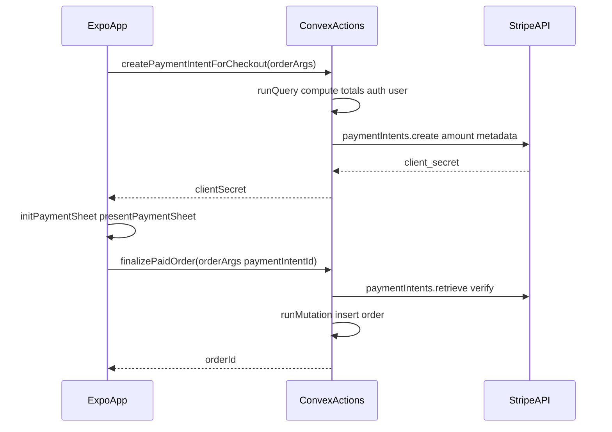

# Expo + Stripe payment flow (phased build)

## Context

- Customer app: [`apps/Pinnochios-Pizza`](c:\Users\DaGra\Builds\Pizza-Delivery-Ai\apps\Pinnochios-Pizza) (Expo SDK 55, Expo Router, Clerk, dev client). Convex API: [`apps/admin/convex`](c:\Users\DaGra\Builds\Pizza-Delivery-Ai\apps\admin\convex) via `@pizza/convex`.
- Checkout today: [`explore.tsx`](c:\Users\DaGra\Builds\Pizza-Delivery-Ai\apps\Pinnochios-Pizza\src\app\explore.tsx) calls [`placeOrder`](c:\Users\DaGra\Builds\Pizza-Delivery-Ai\apps\admin\convex\customer.ts) with no payment.
- Mobile integration (see [Expo Stripe](https://docs.expo.dev/versions/latest/sdk/stripe/) and [Stripe: Accept a payment — React Native](https://docs.stripe.com/payments/accept-a-payment?payment-ui=mobile&platform=react-native)): **PaymentSheet** + server-created **PaymentIntent** + **`StripeProvider`** / **`useStripe`**.

## Target architecture

**Principles:** Server computes **total cents** (same rules as `placeOrder`); PaymentIntent **metadata** for clerk id / debugging; first version can skip Customer + ephemeral key (guest PaymentSheet only).

---

## Phase 1 — Accounts, schema, shared order logic

**Goal:** Stripe and Convex are configured; the database and code are ready for paid orders without duplicating pricing math.

1. Create or open a [Stripe account](https://dashboard.stripe.com/register); copy **test** secret and publishable keys.
2. In the **Convex dashboard** for this deployment, add environment variable `STRIPE_SECRET_KEY` (test key).
3. In [`apps/admin/convex/schema.ts`](c:\Users\DaGra\Builds\Pizza-Delivery-Ai\apps\admin\convex\schema.ts), add optional `stripePaymentIntentId` on `orders` (reconciliation and support).
4. Refactor [`apps/admin/convex/customer.ts`](c:\Users\DaGra\Builds\Pizza-Delivery-Ai\apps\admin\convex\customer.ts):
   - Extract **line/subtotal/tax computation** into an **`internalQuery`** (or shared module + internal query) that takes the same args as `placeOrder` and returns validated `subtotalCents`, `taxCents`, `totalCents`, and the **line snapshots** needed to insert `orders` / `orderItems`.
   - Extract **DB insert** into an **`internalMutation`** (e.g. `insertOrderFromCheckout`) that accepts those snapshots plus optional `stripePaymentIntentId`.
   - Update public **`placeOrder`** to call the internal query + internal mutation (behavior unchanged until Phase 4 gates it), so Stripe and unpaid paths share one insert implementation.

**Exit criteria:** `npx convex dev` / deploy succeeds; `placeOrder` still works; new internal functions are callable from actions in Phase 2.

---

## Phase 2 — Convex Stripe API (PaymentIntent + finalize)

**Goal:** Backend can create a PaymentIntent for a validated cart and finalize an order only after Stripe reports success.

1. Add the official **`stripe`** package to [`apps/admin/package.json`](c:\Users\DaGra\Builds\Pizza-Delivery-Ai\apps\admin\package.json) and install.
2. Add [`apps/admin/convex/stripeCheckout.ts`](c:\Users\DaGra\Builds\Pizza-Delivery-Ai\apps\admin\convex\stripeCheckout.ts) with **`"use node";`** at the top.
3. Implement **`createPaymentIntentForCheckout`** (public `action`):
   - Validate auth (same identity / `ensureUserRow` pattern as mutations—via `ctx.runQuery` to an internal helper that throws if unauthorized).
   - `ctx.runQuery(internal....validatedCheckoutTotals, args)` → `totalCents`.
   - `stripe.paymentIntents.create({ amount: totalCents, currency: "usd", automatic_payment_methods: { enabled: true }, metadata: { clerkId, ... } })`.
   - Return `{ clientSecret: pi.client_secret, paymentIntentId: pi.id }` so the client can call finalize without parsing the secret (never return the Stripe secret key).
4. Implement **`finalizePaidOrder`** (public `action`):
   - Args: same order payload as `placeOrder` plus `paymentIntentId` string.
   - Recompute `totalCents` via the same internal query; `stripe.paymentIntents.retrieve(paymentIntentId)`; require `status === "succeeded"` and **amount matches** `totalCents`.
   - `ctx.runMutation(internal.customer.insertOrderFromCheckout, { ..., stripePaymentIntentId: paymentIntentId })`.
   - Return `{ orderId }` for the existing receipt UI.

**Exit criteria:** From Convex dashboard or a small test script, you can create a PI and (with a test payment on the client in Phase 4) finalize yields a row with `stripePaymentIntentId` set.

---

## Phase 3 — Expo native SDK and app config

**Goal:** The app loads Stripe native modules and initializes the SDK with keys and return URL.

1. In **`apps/Pinnochios-Pizza`**, run `npx expo install @stripe/stripe-react-native` (version aligned with Expo SDK 55 per [Expo doc](https://docs.expo.dev/versions/latest/sdk/stripe/)).
2. Update [`apps/Pinnochios-Pizza/app.json`](c:\Users\DaGra\Builds\Pizza-Delivery-Ai\apps\Pinnochios-Pizza\app.json):
   - Add config plugin entry for `@stripe/stripe-react-native` (`merchantIdentifier` when Apple Pay is ready; `enableGooglePay` if desired on Android).
   - Keep using existing **`scheme`** `pinnochiospizza` as Stripe **`urlScheme`** for 3DS / bank returns.
3. Add **`EXPO_PUBLIC_STRIPE_PUBLISHABLE_KEY`** to the Pinnochios env file (test publishable key).
4. In [`src/app/_layout.tsx`](c:\Users\DaGra\Builds\Pizza-Delivery-Ai\apps\Pinnochios-Pizza\src\app\_layout.tsx), wrap the signed-in tree (e.g. around `CartProvider`) with **`StripeProvider`**:
   - `publishableKey={process.env.EXPO_PUBLIC_STRIPE_PUBLISHABLE_KEY!}`
   - `urlScheme` matching app scheme, or use **`expo-linking`** + **`expo-constants`** pattern from [Expo “Common issues”](https://docs.expo.dev/versions/latest/sdk/stripe/) for Expo Go vs standalone.

**Exit criteria:** App builds; no runtime crash from missing provider; native project regenerates cleanly after prebuild / `expo run:*`.

---

## Phase 4 — Cart UI: PaymentSheet and order finalization

**Goal:** Checkout on **iOS/Android** collects payment then creates the order through `finalizePaidOrder`.

1. In [`explore.tsx`](c:\Users\DaGra\Builds\Pizza-Delivery-Ai\apps\Pinnochios-Pizza\src\app\explore.tsx):
   - `useAction` for `createPaymentIntentForCheckout` and `finalizePaidOrder`.
   - `useStripe` for `initPaymentSheet` and `presentPaymentSheet`.
   - Replace the direct **`placeOrder`** path on **native** with: preflight checks (cart, address, Convex auth) unchanged → call action for `{ clientSecret, paymentIntentId }` → `initPaymentSheet({ paymentIntentClientSecret, merchantDisplayName, ... })` → on button press `presentPaymentSheet()` → on success call `finalizePaidOrder` with the **`paymentIntentId`** from Phase 2 → then existing receipt flow (`orderId`, `clear()`, etc.).
2. **Web:** `Platform.OS === "web"` — disable PaymentSheet path; show a short message (“Pay in the mobile app”) or keep temporary unpaid `placeOrder` only for web if you need demos (document as insecure for production).

**Exit criteria:** Full happy path on device/simulator: pay with test card → order appears in DB with `stripePaymentIntentId`.

---

## Phase 5 — Builds, wallets, and regression testing

**Goal:** Production-like behavior and edge cases.

1. Create a **development build** (`expo run:ios` / `expo run:android` or EAS). PaymentSheet works in Expo Go for basic cards; **Apple Pay / Google Pay** need a dev build per [Expo limitations](https://docs.expo.dev/versions/latest/sdk/stripe/).
2. Test [Stripe test cards](https://docs.stripe.com/testing), including **3DS**; confirm return to app via `urlScheme`.
3. Optional: configure **Apple Pay** (merchant ID in plugin + `initPaymentSheet` Apple Pay params per [Stripe RN doc](https://docs.stripe.com/payments/accept-a-payment?payment-ui=mobile&platform=react-native)).
4. Error UX: user cancels sheet, network failures, finalize after failed payment (should not insert order).
5. Decide whether **public `placeOrder`** remains for admin/tests only or is removed/guarded so customers cannot bypass pay on native.

**Exit criteria:** Checklist above passes; team agrees on `placeOrder` policy.

---

## Environment summary

| Where | Variable |
|-------|----------|
| Convex dashboard | `STRIPE_SECRET_KEY` |
| Pinnochios `.env` | `EXPO_PUBLIC_STRIPE_PUBLISHABLE_KEY` |

## References

- [Expo: `@stripe/stripe-react-native`](https://docs.expo.dev/versions/latest/sdk/stripe/)
- [Stripe: Accept a payment (mobile, React Native)](https://docs.stripe.com/payments/accept-a-payment?payment-ui=mobile&platform=react-native)
