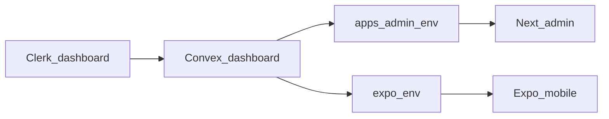

# Pizza MVP — Operational implementation plan

This runbook assumes the codebase already matches the phased technical plan (Convex in [`apps/admin/convex`](c:\Users\DaGra\Builds\Pizza-Delivery-Ai\apps\admin\convex), Next admin in [`apps/admin`](c:\Users\DaGra\Builds\Pizza-Delivery-Ai\apps\admin), Expo app in [`apps/Pinnochios-Pizza`](c:\Users\DaGra\Builds\Pizza-Delivery-Ai\apps\Pinnochios-Pizza)). It covers **accounts, configuration, commands, and verification** only.

---

## 1. Accounts and tooling

| Step | Action |
|------|--------|
| 1.1 | Create or use a **Clerk** application (dev keys are fine). |
| 1.2 | Create or use a **Convex** account; you will attach a **dev** deployment to this repo. |
| 1.3 | Install **Node** and use **`npm`** (or your package manager) in [`apps/admin`](c:\Users\DaGra\Builds\Pizza-Delivery-Ai\apps\admin) and [`apps/Pinnochios-Pizza`](c:\Users\DaGra\Builds\Pizza-Delivery-Ai\apps\Pinnochios-Pizza). |
| 1.4 | For Expo, install **Expo CLI** / dev client as you already do; iOS simulator or Android emulator optional but recommended for Phase 6. |

---

## 2. Link Convex to this repo (one deployment)

| Step | Action |
|------|--------|
| 2.1 | From [`apps/admin`](c:\Users\DaGra\Builds\Pizza-Delivery-Ai\apps\admin), run **`npx convex dev`** once and complete login (browser) or your team’s approved headless flow. |
| 2.2 | Confirm Convex wrote **`NEXT_PUBLIC_CONVEX_URL`** (or equivalent) into [`apps/admin/.env.local`](c:\Users\DaGra\Builds\Pizza-Delivery-Ai\apps\admin\.env.local) (or copy the deployment URL from the Convex dashboard). |
| 2.3 | Keep **`npx convex dev`** running while developing so schema and functions stay synced (per project scripts, `npm run dev` may run it in parallel with Next). |

**Exit:** Convex dashboard shows your dev deployment; [`.env.local`](c:\Users\DaGra\Builds\Pizza-Delivery-Ai\apps\admin\.env.local) contains the same URL you will paste into the mobile app in section 4.

---

## 3. Clerk + Convex auth (backend)

| Step | Action |
|------|--------|
| 3.1 | In Clerk, add the **Convex** JWT integration / template per [Convex + Clerk](https://docs.convex.dev/auth/clerk) (issuer + `applicationID: convex`). |
| 3.2 | Set Convex **deployment environment variables** in the Convex dashboard: **`CLERK_FRONTEND_API_URL`** must match Clerk’s Frontend API URL (same value family as `CLERK_JWT_ISSUER_DOMAIN` in some docs). |
| 3.3 | Locally, [`apps/admin/convex/auth.config.ts`](c:\Users\DaGra\Builds\Pizza-Delivery-Ai\apps\admin\convex\auth.config.ts) expects **`CLERK_FRONTEND_API_URL`** in the environment Convex uses when deploying functions (often set via dashboard for dev/prod). If `convex dev` fails at push with missing env, set that variable for the dev deployment. |

**Exit:** `npx convex dev` pushes without auth config errors; signing in from Next or Expo yields a real `ctx.auth.getUserIdentity()` in Convex (verified after section 5).

---

## 4. Environment variables — both apps, same deployment

| App | Required (minimum) | Purpose |
|-----|-------------------|--------|
| **Admin** [`apps/admin`](c:\Users\DaGra\Builds\Pizza-Delivery-Ai\apps\admin) | `NEXT_PUBLIC_CONVEX_URL` | Convex client ([`ConvexClientProvider.tsx`](c:\Users\DaGra\Builds\Pizza-Delivery-Ai\apps\admin\components\ConvexClientProvider.tsx)) |
| | `NEXT_PUBLIC_CLERK_PUBLISHABLE_KEY` (and server `CLERK_SECRET_KEY` per Clerk Next.js docs) | Clerk ([`app/layout.tsx`](c:\Users\DaGra\Builds\Pizza-Delivery-Ai\apps\admin\app\layout.tsx)) |
| **Mobile** [`apps/Pinnochios-Pizza`](c:\Users\DaGra\Builds\Pizza-Delivery-Ai\apps\Pinnochios-Pizza) | `EXPO_PUBLIC_CONVEX_URL` | **Same URL** as admin ([`ConvexClientProvider`](c:\Users\DaGra\Builds\Pizza-Delivery-Ai\apps\Pinnochios-Pizza\src\components\ConvexClientProvider.tsx)) |
| | `EXPO_PUBLIC_CLERK_PUBLISHABLE_KEY` | Clerk Expo |

| Step | Action |
|------|--------|
| 4.1 | Copy **`NEXT_PUBLIC_CONVEX_URL`** from admin `.env.local` into the mobile app’s env (e.g. `.env` / EAS secrets / `app.config` — follow your Expo workflow). **`EXPO_PUBLIC_CONVEX_URL` must be identical.** |
| 4.2 | Use the **same Clerk application** (or compatible instances) for both frontends so the same users can sign in on web and mobile. |
| 4.3 | Restart dev servers after env changes (`npm run dev`, `npx expo start -c`). |

**Exit:** Both apps start without throwing missing `CONVEX_URL` / Clerk key errors.

---

## 5. First sign-in and Convex `users` row

| Step | Action |
|------|--------|
| 5.1 | Open the admin app (e.g. `http://localhost:3000`), sign in with Clerk. |
| 5.2 | The mobile app calls **`users.syncUser`** on load; ensure you open the app signed in at least once so a **`users`** document exists with your `clerkId` and default **`customer`** role. |

**Exit:** Convex **Data** tab shows a document in `users` for your Clerk subject.

---

## 6. Grant admin access (required for `/admin`)

Admin UI and `api.admin.*` require **`users.role === "admin"`** in Convex (enforced in [`convex/auth.ts`](c:\Users\DaGra\Builds\Pizza-Delivery-Ai\apps\admin\convex\auth.ts)), not Clerk UI alone.

| Step | Action |
|------|--------|
| 6.1 | Get your **`clerkId`**: Clerk dashboard (user) or JWT `sub` (often `user_...`). |
| 6.2 | Run the **internal** mutation from the repo root used for Convex, e.g. from `apps/admin`: `npx convex run internal:users:setUserRoleInternal` with JSON args `{"clerkId":"...","role":"admin"}` (exact CLI flags depend on Convex version; use **`npx convex run --help`** or the **Functions** tab in the dashboard to confirm the reference name). The UI copy in [`require-admin.tsx`](c:\Users\DaGra\Builds\Pizza-Delivery-Ai\apps\admin\components\admin\require-admin.tsx) matches this intent. |
| 6.3 | Reload **`/admin/orders`** — you should see the shell, not the “admin access required” panel. |

**Exit:** [`api.users.viewer`](c:\Users\DaGra\Builds\Pizza-Delivery-Ai\apps\admin\convex\users.ts) shows `role: "admin"` for that user.

---

## 7. Optional dev catalog + images (seed)

Source: [`apps/admin/convex/seed.ts`](c:\Users\DaGra\Builds\Pizza-Delivery-Ai\apps\admin\convex\seed.ts) (comments at top; internal **action** `seedDevCatalogInternal`, internal mutation **`clearDevSeedInternal`**).

| Step | Action |
|------|--------|
| 7.1 | With network access (action fetches Unsplash), run the **seed** internal function once via CLI or dashboard (verify exact name: **`internal:seed:seedDevCatalogInternal`** pattern). |
| 7.2 | Confirm **Data** has `pizzas` / `ingredients` with `seedTag: "dev"` and images in **`_storage`**. |
| 7.3 | To remove: run **`clearDevSeedInternal`** as documented in the same file. |

**Exit:** Customer **`listMenuPizzas`** returns rows with **`imageUrl`** set.

---

## 8. Smoke test checklist (Phase 6 acceptance)

Run these manually; they map to the plan’s acceptance criteria.

| # | Check |
|---|--------|
| 8.1 | **Mobile:** Browse menu, add to cart, place order; order appears under Profile. |
| 8.2 | **Admin:** Orders board shows the new order under **Placed** without manual refresh (Convex subscription). |
| 8.3 | **Admin:** Advance order status step-by-step; **Mobile:** order status updates in the list/detail. |
| 8.4 | **Admin:** Toggle pizza/ingredient; **Mobile:** menu reflects availability/price after reactive query refresh. |
| 8.5 | **Security:** Sign in as a non-admin user (or temporarily demote): Convex **admin** mutations must **throw** in the dashboard or in Network tab; UI may hide `/admin` via [`proxy.ts`](c:\Users\DaGra\Builds\Pizza-Delivery-Ai\apps\admin\proxy.ts) but backend is source of truth. |

---

## 9. Build and deploy hygiene

| Step | Action |
|------|--------|
| 9.1 | Production build admin from `apps/admin`: **`npm run build`**. Keep `npm run build` cwd = **`apps/admin`** so [`next.config.ts`](c:\Users\DaGra\Builds\Pizza-Delivery-Ai\apps\admin\next.config.ts) `process.cwd()` matches the app. |
| 9.2 | For production: duplicate Convex **prod** deployment env vars, Clerk **live** keys, EAS env for Expo, and repeat admin promotion for a prod admin user. |

---

## 10. Troubleshooting (fast pointers)

- **`CLERK_FRONTEND_API_URL` missing** — set on Convex deployment; redeploy functions.  
- **Same user, different data on mobile vs web** — almost always **different `*_CONVEX_URL`**.  
- **401/Unauthorized on Convex** — Clerk JWT not configured or wrong issuer; compare Clerk dashboard to Convex auth settings.  
- **`/admin` blank** — not signed in (proxy), or not admin (section 6).  
- **Seed fails on fetch** — network/firewall blocking Unsplash; run from a network that allows outbound HTTPS.

This operational plan is independent of editing [`.cursor/plans/pizza_mvp_phased_steps_4f780f6d.plan.md`](c:\Users\DaGra\Builds\Pizza-Delivery-Ai\.cursor\plans\pizza_mvp_phased_steps_4f780f6d.plan.md); you can paste this runbook into team docs or a `RUNBOOK.md` if you want it versioned with the repo.
