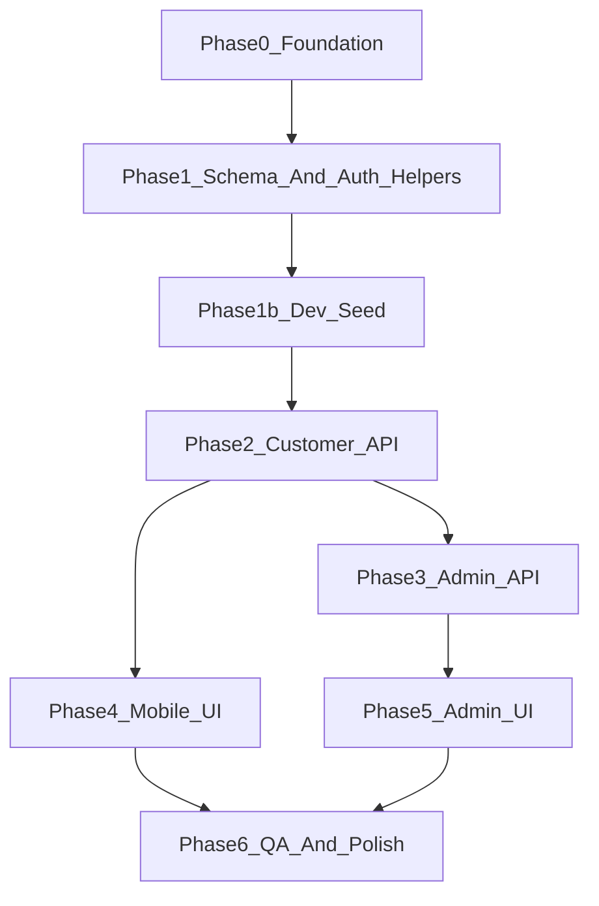

# Pizza MVP — Phased Step-by-Step Plan

This is the same product scope and architecture as [`.cursor/plans/pizza_mvp_shared_convex_7a26236b.plan.md`](c:\Users\DaGra\Builds\Pizza-Delivery-Ai\.cursor\plans\pizza_mvp_shared_convex_7a26236b.plan.md): one Convex backend in [`apps/admin/convex`](c:\Users\DaGra\Builds\Pizza-Delivery-Ai\apps\admin\convex), Clerk for identity, admin via role metadata enforced in Convex, mobile app [`Pinnochios-Pizza`](c:\Users\DaGra\Builds\Pizza-Delivery-Ai\Pinnochios-Pizza) and the **Next.js admin app** at [`apps/admin`](c:\Users\DaGra\Builds\Pizza-Delivery-Ai\apps\admin) using **[shadcn/ui](https://ui.shadcn.com/)** for all admin UI.

**Project-local agent skills** are installed under [`apps/admin/.agents/skills/`](c:\Users\DaGra\Builds\Pizza-Delivery-Ai\apps\admin\.agents\skills): read the matching `SKILL.md` **before** implementing that area—[`shadcn/SKILL.md`](c:\Users\DaGra\Builds\Pizza-Delivery-Ai\apps\admin\.agents\skills\shadcn\SKILL.md) for Phase 5; Convex-related skills (`convex-quickstart`, `convex-setup-auth`, `convex-migration-helper`, `convex-performance-audit`, `convex-create-component`) for schema, auth, migrations, and components as relevant to Phases 1–3.

---

## Phase 0 — Foundation and environment

**Goal:** Both apps talk to the same deployment; Clerk auth config is ready before coding domain logic.

| Step | Action |
|------|--------|
| 0.1 | Confirm [`apps/admin/.env.local`](c:\Users\DaGra\Builds\Pizza-Delivery-Ai\apps\admin\.env.local) has `NEXT_PUBLIC_CONVEX_URL` and [`Pinnochios-Pizza/.env`](c:\Users\DaGra\Builds\Pizza-Delivery-Ai\Pinnochios-Pizza\.env) has `EXPO_PUBLIC_CONVEX_URL` pointing at the **same** Convex deployment. |
| 0.2 | Review [`apps/admin/convex/auth.config.ts`](c:\Users\DaGra\Builds\Pizza-Delivery-Ai\apps\admin\convex\auth.config.ts) for Clerk provider settings; adjust only if needed for your Clerk app. |
| 0.3 | Run `npx convex dev` from the admin project (per Convex dev workflow) so schema pushes and functions stay in sync while building. |

**Exit criteria:** Convex dashboard shows one dev deployment; both env files reference it.

---

## Phase 1 — Schema, indexes, and auth helpers

**Goal:** Replace starter `numbers`-style schema with pizza domain tables and shared auth utilities (no full UI yet).

| Step | Action |
|------|--------|
| 1.1 | Update [`apps/admin/convex/schema.ts`](c:\Users\DaGra\Builds\Pizza-Delivery-Ai\apps\admin\convex\schema.ts): `users`, `ingredients`, `pizzas`, `orders`, `orderItems`; optional `inventoryEvents` if you want audit from day one. **Pizza images:** store `v.id("_storage")` on `pizzas` (e.g. `imageId`), not a plain external URL string—MVP uses [Convex file storage](https://docs.convex.dev/file-storage) immediately. Customer/admin UIs resolve a display URL with `ctx.storage.getUrl(imageId)` in queries (or return the URL alongside other fields). |
| 1.2 | Add indexes: orders by `clerkId` and `status`; pizzas by `isAvailable` / category; `orderItems` by `orderId` (and any other lookups your queries will need). |
| 1.3 | Add [`apps/admin/convex/auth.ts`](c:\Users\DaGra\Builds\Pizza-Delivery-Ai\apps\admin\convex\auth.ts) (or equivalent): `requireAuth`, `requireAdmin` using Clerk identity + role claim from JWT/metadata. |
| 1.4 | Remove or narrow starter code in [`apps/admin/convex/myFunctions.ts`](c:\Users\DaGra\Builds\Pizza-Delivery-Ai\apps\admin\convex\myFunctions.ts) as you split real API into `customer.ts` / `admin.ts`. |

**Exit criteria:** `convex dev` pushes schema without errors; auth helpers compile and are callable from new functions.

---

## Phase 1b — Dev-only seed data (catalog + Unsplash → storage)

**Goal:** Local and shared dev deployments get sample ingredients and pizzas **with real images in Convex storage**, sourced from **Unsplash** (copyright-friendly [Unsplash License](https://unsplash.com/license)). Seeded rows and files must be **easy to strip out** in one shot. **Not** a public API: **internal** Convex functions only.

**Why an action + mutation split:** HTTP `fetch` to download images runs in an **`internalAction`**; writing DB rows and calling `ctx.storage.store` can live there (actions support `storage.store`) or the action can `fetch` → `store` → `ctx.runMutation` for inserts—pick one clear orchestration and keep it in a small module (e.g. [`apps/admin/convex/seed.ts`](c:\Users\DaGra\Builds\Pizza-Delivery-Ai\apps\admin\convex\seed.ts)).

| Step | Action |
|------|--------|
| 1b.1 | Maintain a **small static list** of Unsplash image URLs (or use the [Unsplash API](https://unsplash.com/documentation) with a dev-only access key in env if you prefer search—optional). Only use images you are allowed to redistribute per Unsplash’s terms; keep **attribution metadata** in code comments or optional `imageCredit` fields on `pizzas` for UI later. |
| 1b.2 | In an `internalAction`, for each pizza image: `fetch(url)` → `blob` → `ctx.storage.store(blob)` → persist returned `Id<"_storage">` on the `pizzas` document. |
| 1b.3 | Tag every seeded catalog row with a **stable discriminator** (e.g. `seedTag: "dev"` or `seedBatchId: v.string()`) so queries/filters can target seed data. Optionally maintain a **`seedManifest`** internal table or singleton doc listing inserted doc ids and storage ids for deterministic cleanup. |
| 1b.4 | **Idempotent run:** before inserting, check slug/seedVersion/manifest so re-running `seedDevCatalog` does not duplicate pizzas or orphan extra blobs (or: clear-then-seed—see 1b.5). |
| 1b.5 | **`clearDevSeed` (required):** internal `internalMutation` (or action + mutation) that deletes all seed-tagged `pizzas`/`ingredients`, and for each associated `imageId` calls `ctx.storage.delete(imageId)` so Convex storage stays clean. Document `npx convex run …` for both seed and clear. |
| 1b.6 | Run seed/clear only from CLI or dashboard in dev; **never** expose as public `mutation`/`action` from mobile or admin. |

**Exit criteria:** After seed, menu queries show pizzas with resolvable `getUrl` images; after `clearDevSeed`, no seed rows remain and no orphaned `_storage` blobs for those images; re-seed works predictably.

**Future migration note:** If you ever move strategies, the schema already uses `_storage` ids; no “string URL → storage” migration needed for MVP.

---

## Phase 2 — Customer-facing Convex API

**Goal:** Authenticated customers can read menu and create/read their own orders.

| Step | Action |
|------|--------|
| 2.1 | Implement `convex/customer.ts` (or split files): list available pizzas and ingredients (validated args, typed returns). Include **resolved image URLs** for pizzas (`getUrl` on `imageId`) so clients use a normal `https://…` string for `<Image />`. |
| 2.2 | Implement `placeOrder` (or equivalent): cart payload → `orders` + `orderItems` with price snapshots; tie order to `clerkId` / internal `userId` as designed in schema. |
| 2.3 | Implement list + detail queries for the **current user’s** orders only (no cross-user leakage). |
| 2.4 | Manually test from Convex dashboard or a minimal script: place order, list orders. |

**Exit criteria:** Customer mutations/queries work with a test user; admin functions not required yet.

---

## Phase 3 — Admin Convex API

**Goal:** Only admins can mutate menu/inventory and move orders through the pipeline (`placed` → `preparing` → `out_for_delivery` → `delivered`).

| Step | Action |
|------|--------|
| 3.1 | Implement `convex/admin.ts`: pizza and ingredient CRUD + availability / stock toggles; every public function starts with `requireAdmin`. **Pizza images:** use the standard Convex flow (`generateUploadUrl` → client `PUT` → mutation saves `imageId` on the pizza); optionally delete previous `imageId` from storage when replacing. |
| 3.2 | Implement order board queries (e.g. by status, recent first) for admin UI. |
| 3.3 | Implement order status mutation with **forward-only** allowed transitions; reject invalid jumps. |
| 3.4 | Negative tests: call admin mutations with a non-admin token (should fail). |

**Exit criteria:** Admin APIs complete; role enforcement is on the backend, not only in Next.js.

---

## Phase 4 — Mobile app (Pinnochios-Pizza)

**Goal:** Menu, cart, checkout, and order history with live updates; keep existing NativeTabs in [`app-tabs.tsx`](c:\Users\DaGra\Builds\Pizza-Delivery-Ai\Pinnochios-Pizza\src\components\app-tabs.tsx) and layout in [`_layout.tsx`](c:\Users\DaGra\Builds\Pizza-Delivery-Ai\Pinnochios-Pizza\src\app\_layout.tsx).

| Step | Action |
|------|--------|
| 4.1 | Wire Convex React client + Clerk in the mobile app (mirror patterns from admin if useful); ensure `EXPO_PUBLIC_CONVEX_URL` is used. |
| 4.2 | Add cart state (Context or small store): add/remove/update quantity, derive totals client-side to match server expectations. |
| 4.3 | **`index.tsx`:** category chips + pizza cards; subscribe to menu query; add-to-cart + haptics (`expo-haptics`) as polish. |
| 4.4 | **`explore.tsx`:** cart review + checkout → call `placeOrder` mutation; clear cart on success. |
| 4.5 | **`profile.tsx`:** order list + detail/status timeline using reactive queries. |
| 4.6 | Optional polish: `expo-image`, `expo-blur` / glass-style headers, `expo-symbols` on iOS — without changing tab navigation. |

**Exit criteria:** Full happy path on device/simulator: browse → cart → place order → see order + status updates.

---

## Phase 5 — Admin app (Next.js + shadcn/ui)

**Goal:** Operational UI for menu, ingredients, and order board; **built entirely with shadcn/ui primitives**; UI gated by Clerk role, duplicate enforcement in Convex.

**Stack:** The admin app lives at [`apps/admin`](c:\Users\DaGra\Builds\Pizza-Delivery-Ai\apps\admin). [`components.json`](c:\Users\DaGra\Builds\Pizza-Delivery-Ai\apps\admin\components.json) is already present (e.g. `radix-nova` style, RSC, `@/components/ui`). Install the **full default component set** up front so forms, tables, dialogs, and layout are available before building features.

**Agent skills (use during implementation):** **Read [`apps/admin/.agents/skills/shadcn/SKILL.md`](c:\Users\DaGra\Builds\Pizza-Delivery-Ai\apps\admin\.agents\skills\shadcn\SKILL.md) first**—before `add --all` and before composing screens—and follow its CLI patterns, component conventions, and theming guidance. If a detail is missing from the skill, use the **docs-researcher** subagent or [official shadcn docs](https://ui.shadcn.com/docs) rather than guessing flags or APIs.

| Step | Action |
|------|--------|
| 5.1 | **Read [`apps/admin/.agents/skills/shadcn/SKILL.md`](c:\Users\DaGra\Builds\Pizza-Delivery-Ai\apps\admin\.agents\skills\shadcn\SKILL.md) first.** From [`apps/admin`](c:\Users\DaGra\Builds\Pizza-Delivery-Ai\apps\admin), run **`npx shadcn@latest add --all`** (optional: `add --all --dry-run` first) so every registry component is added under [`apps/admin/components/ui`](c:\Users\DaGra\Builds\Pizza-Delivery-Ai\apps\admin\components\ui). Resolve any CLI prompts so the install completes cleanly; commit the generated files. If the CLI changes `components.json` or `app/globals.css`, keep Tailwind v4 + existing Clerk/Convex layout compatible. |
| 5.2 | Keep [`apps/admin/app/layout.tsx`](c:\Users\DaGra\Builds\Pizza-Delivery-Ai\apps\admin\app\layout.tsx) and [`ConvexClientProvider.tsx`](c:\Users\DaGra\Builds\Pizza-Delivery-Ai\apps\admin\components\ConvexClientProvider.tsx); add route-level protection for admin sections (Clerk role check). Use shadcn **Sidebar** / **Navigation** patterns where appropriate for the admin shell. |
| 5.3 | Build **pizza management** with shadcn (e.g. **Table**, **Dialog** or **Sheet**, **Form** + **Input**, **Switch** for availability, **Button**): CRUD, **image upload** (upload URL → save storage id), wired to admin mutations. |
| 5.4 | Build **ingredient management** with the same primitives: CRUD, active/in-stock toggles. |
| 5.5 | Build **orders board**: group or filter by status (**Tabs** or **Select**); status transitions (**Button** / **DropdownMenu**); live Convex subscriptions; use **Card**, **Badge**, and **ScrollArea** as needed. |

**Exit criteria:** Full shadcn component library is present under `components/ui`; admin can manage catalog and move orders using only shadcn-based (or shadcn-composed) components; non-admin cannot access routes (and backend still rejects even if UI is bypassed).

---

## Phase 6 — Integration, real-time validation, and acceptance QA

**Goal:** Prove one shared backend drives both clients; document any Clerk dashboard steps (e.g. assigning admin role).

| Step | Action |
|------|--------|
| 6.1 | Two-client test: place order on mobile → appears on admin board without refresh. |
| 6.2 | Admin changes status → mobile order view updates in real time. |
| 6.3 | Admin edits menu/ingredients → mobile menu reflects changes (availability, prices). |
| 6.4 | Security spot-check: non-admin session cannot run admin mutations (Convex errors). |
| 6.5 | Run through the **Testing & Acceptance** checklist from the original plan (order lifecycle, CRUD visibility, permissions). |

**Exit criteria:** All acceptance bullets pass; known limitations noted for post-MVP.

---

## How this maps to the old “Delivery Sequence”

| Old sequence | New home |
|--------------|----------|
| Backend schema + auth helpers + role checks | Phases 0–1 (+ admin role usage in 3) |
| (not in original) Dev catalog seed + Unsplash → storage | Phase 1b |
| Customer menu/cart/place-order | Phases 2 + 4 |
| Admin CRUD and order operations | Phases 3 + 5 (shadcn/ui for admin) |
| Real-time UX + Expo polish | Phase 4 (polish) + Phase 6 |
| QA pass | Phase 6 |

---

## Notes

- **Order pipeline:** status transitions only move forward.
- **Security:** validate args/returns on public Convex functions; admin checks on server.
- **Indexing:** prefer indexes over unbounded `filter()` for order/pizza queries ([query optimization](https://docs.convex.dev/database/reading-data)).
- **Images:** `pizzas.imageId` → Convex `_storage`; clients never need raw Unsplash URLs after seed—only signed `getUrl` links from Convex.
- **Unsplash:** keep attribution where required; dev seed is a fixed allowlist of URLs or API-backed picks, not arbitrary hotlinking in production UI.
- **Removing seed:** rely on `seedTag` / manifest + `clearDevSeed`; do not scatter seed-only logic outside `seed.ts` and documented CLI commands so it is obvious what to delete or stop calling.
- **Admin UI:** [shadcn/ui](https://ui.shadcn.com/) only for the admin panel; run `npx shadcn@latest add --all` in `apps/admin` before building feature screens so Table, Dialog, Form, Sidebar, etc. are available ([CLI docs](https://ui.shadcn.com/docs/cli)). **Follow [`apps/admin/.agents/skills/shadcn/SKILL.md`](c:\Users\DaGra\Builds\Pizza-Delivery-Ai\apps\admin\.agents\skills\shadcn\SKILL.md)** when installing and composing UI; fall back to docs-researcher or official docs for gaps.
- **Project skills location:** [`apps/admin/.agents/skills/`](c:\Users\DaGra\Builds\Pizza-Delivery-Ai\apps\admin\.agents\skills) (shadcn + Convex skills; see intro paragraph for which phase).
