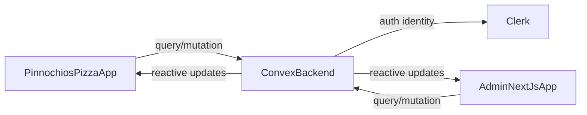

# Pinoochios Pizza MVP Plan

## Product Scope (MVP)
- Customer app (`Pinnochios-Pizza`) supports: browse pizzas, add/remove cart items, place order, view order list + live status.
- Admin app (`admin`) supports: CRUD for pizzas/ingredients/availability and order status transitions (`placed -> preparing -> out_for_delivery -> delivered`).
- Shared backend remains in [c:\Users\DaGra\Builds\Pizza-Delivery-Ai\admin\convex](c:\Users\DaGra\Builds\Pizza-Delivery-Ai\admin\convex) and powers both apps with real-time subscriptions.
- Keep current native tab navigation from [c:\Users\DaGra\Builds\Pizza-Delivery-Ai\Pinnochios-Pizza\src\components\app-tabs.tsx](c:\Users\DaGra\Builds\Pizza-Delivery-Ai\Pinnochios-Pizza\src\components\app-tabs.tsx) (no nav changes based on the image).

## Architecture Decisions
- **Backend ownership:** one Convex deployment used by both apps.
- **Auth model:** Clerk identity in Convex; admin access determined from Clerk role metadata claim (manually assigned in Clerk dashboard).
- **Role enforcement:** every admin mutation/query checks role on backend (not only UI).
- **Order pipeline:** status transitions only move forward to preserve kitchen workflow.

## Data Model (Convex)
Update [c:\Users\DaGra\Builds\Pizza-Delivery-Ai\admin\convex\schema.ts](c:\Users\DaGra\Builds\Pizza-Delivery-Ai\admin\convex\schema.ts) from sample `numbers` table to pizza domain tables:
- `users` (clerkId, role, profile basics)
- `ingredients` (name, inStock, additionalPrice, isActive)
- `pizzas` (name, description, basePrice, imageUrl, isAvailable, category, defaultIngredientIds)
- `orders` (userId/clerkId, status, totals, delivery info, timestamps)
- `orderItems` (orderId, pizzaId, qty, selectedIngredientIds, itemPriceSnapshot)
- optional `inventoryEvents` for stock adjustments/audit trail

Add indexes for frequent lookups:
- orders by `clerkId` and by `status`
- pizzas by `isAvailable` and category
- orderItems by `orderId`

## Convex Function Plan
Replace starter functions in [c:\Users\DaGra\Builds\Pizza-Delivery-Ai\admin\convex\myFunctions.ts](c:\Users\DaGra\Builds\Pizza-Delivery-Ai\admin\convex\myFunctions.ts) with grouped modules:
- `convex/customer.ts`
  - list available pizzas/ingredients
  - place order from cart payload
  - list current user orders + order details
- `convex/admin.ts`
  - pizza/ingredient CRUD
  - order board queries by status
  - order status update mutation with allowed transitions
- `convex/auth.ts` helpers
  - require authenticated user
  - require admin role claim

MVP rules:
- All public functions validate args/returns.
- Admin-only functions throw authorization errors when non-admin.
- Status update mutation enforces allowed transitions.

## Mobile App Plan (Pinnochios-Pizza)
Use current Expo Router + NativeTabs layout in [c:\Users\DaGra\Builds\Pizza-Delivery-Ai\Pinnochios-Pizza\src\app\_layout.tsx](c:\Users\DaGra\Builds\Pizza-Delivery-Ai\Pinnochios-Pizza\src\app\_layout.tsx).

Screens (reusing native tab structure):
- `index.tsx`: menu/home feed with category chips + pizza cards (inspired by image styling).
- `explore.tsx`: cart + checkout summary for placing order.
- `profile.tsx`: order history and live status timeline.

Shared UI/state:
- local cart state (context/store) for add/remove/update qty.
- Convex queries for menu and order list.
- Convex mutation for place order.

SDK 55 polish features (without changing nav paradigm):
- `expo-image` for performant card/product images.
- `expo-haptics` for add-to-cart and status actions.
- `expo-blur`/`expo-glass-effect` for elevated cards/headers where appropriate.
- `expo-symbols` for iOS-native icon feel in supporting places.

## Admin App Plan (Next.js)
Keep existing providers in [c:\Users\DaGra\Builds\Pizza-Delivery-Ai\admin\app\layout.tsx](c:\Users\DaGra\Builds\Pizza-Delivery-Ai\admin\app\layout.tsx) and [c:\Users\DaGra\Builds\Pizza-Delivery-Ai\admin\components\ConvexClientProvider.tsx](c:\Users\DaGra\Builds\Pizza-Delivery-Ai\admin\components\ConvexClientProvider.tsx).

Build pages/components for:
- Pizza management (CRUD + availability toggle)
- Ingredient management (CRUD + active/in-stock toggle)
- Orders board grouped by status with quick transition actions

Access control:
- Protect admin routes in UI via Clerk role checks.
- Enforce same checks again in Convex admin functions.

## Integration and Env Alignment
Ensure both apps point to the same Convex deployment URL:
- mobile: `EXPO_PUBLIC_CONVEX_URL` in [c:\Users\DaGra\Builds\Pizza-Delivery-Ai\Pinnochios-Pizza\.env](c:\Users\DaGra\Builds\Pizza-Delivery-Ai\Pinnochios-Pizza\.env)
- admin: `NEXT_PUBLIC_CONVEX_URL` in [c:\Users\DaGra\Builds\Pizza-Delivery-Ai\admin\.env.local](c:\Users\DaGra\Builds\Pizza-Delivery-Ai\admin\.env.local)

Verify Convex auth provider settings in [c:\Users\DaGra\Builds\Pizza-Delivery-Ai\admin\convex\auth.config.ts](c:\Users\DaGra\Builds\Pizza-Delivery-Ai\admin\convex\auth.config.ts) remain valid for Clerk.

## Testing & Acceptance
- Customer can place an order from cart in mobile app.
- Order appears immediately in admin order board.
- Admin status change appears live in mobile order history.
- Non-admin cannot access admin pages or admin Convex mutations.
- Pizza/ingredient CRUD changes reflect live in customer app.

## Delivery Sequence
1. Backend schema + auth helpers + role checks.
2. Customer menu/cart/place-order flow.
3. Admin CRUD and order operations.
4. Real-time order status UX + Expo SDK 55 visual polish.
5. QA pass across auth, permissions, and order lifecycle.